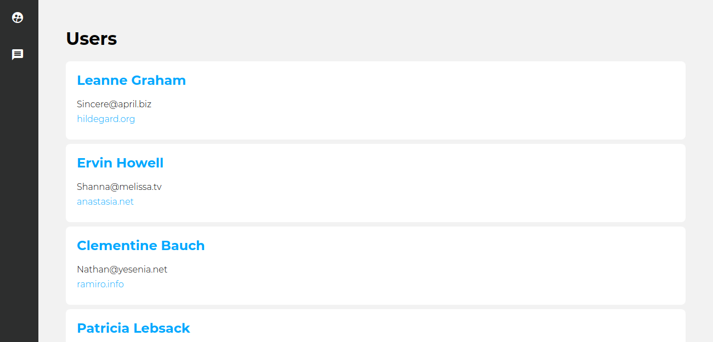
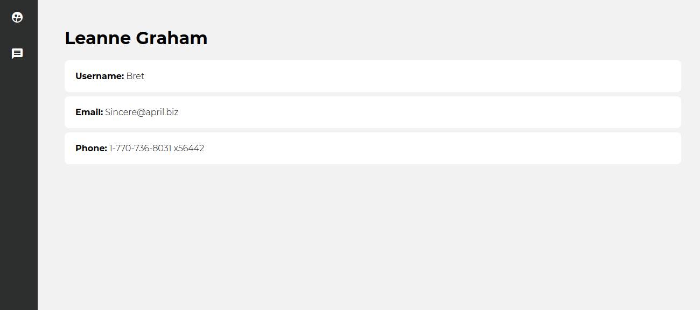
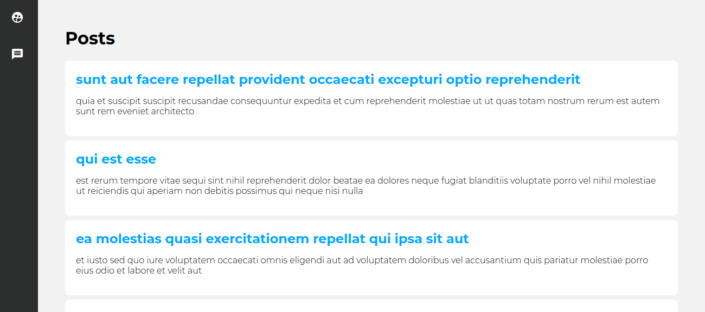

# first_angular6

This is my first angular 6 project for learning purpose.

## Feature

* Using random data (post and username) and show as a list
* Seperate user detail page
* ajax call

## Installation

run this command after pulling this repo
> ng serve --open

It will open in a browser "http://localhost:4200/"

## Snapshot

* User list

* User detail page

* Post list

